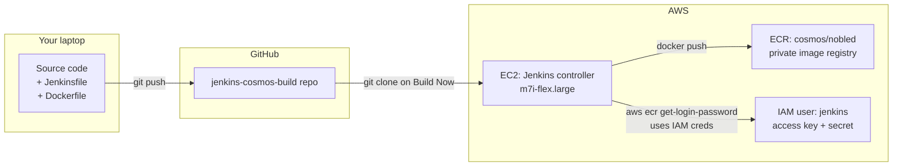
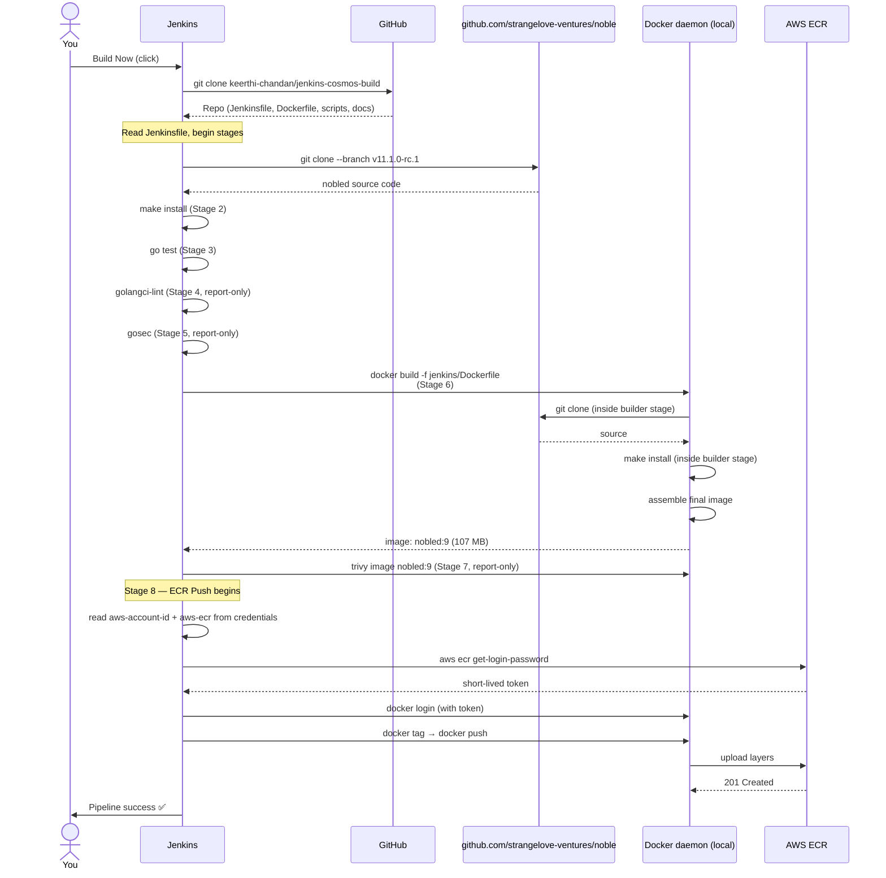
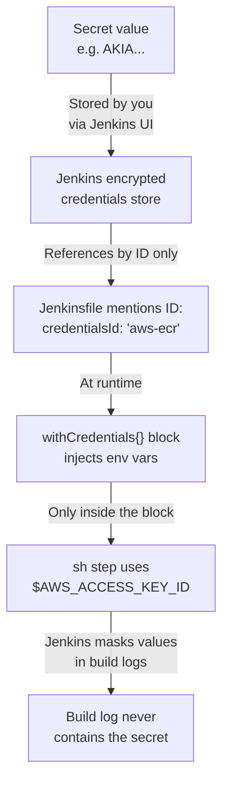
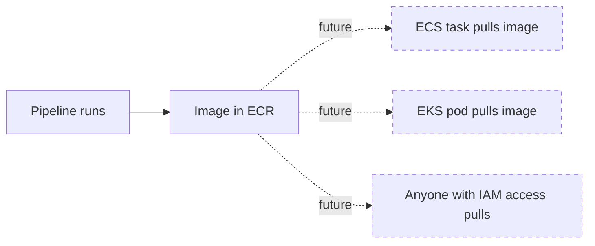

# Tutorial — understanding the Noble testnet Jenkins pipeline

A learning-oriented walkthrough of what this repo does and why every line of the Jenkinsfile and Dockerfile is the way it is. If `procedure.md` is the **recipe**, this is the **cooking lesson**.

**What you'll learn:**
- What CI/CD actually means (in plain language), and what problem this pipeline solves
- How Jenkins, Docker, and ECR fit together as a system
- How to read a Jenkinsfile block-by-block
- How a multistage Dockerfile works and why we use one
- The pipeline's execution flow + how secrets travel through it
- Where this pipeline stops and what comes next

---

## 1. The problem CI/CD solves

You wrote some code. To turn that code into "something running in production," it has to go through a chain of steps:

1. Compile / build it
2. Run tests
3. Lint it for bad patterns
4. Scan for security issues
5. Package it into a deployable artifact (binary, container image, etc.)
6. Publish that artifact somewhere others can pull from
7. Deploy it

**Doing this manually every time** is slow, error-prone, and depends on the discipline of whoever's deploying. Some steps get skipped, environments drift between developers, and "works on my machine" surfaces in production.

**CI/CD = Continuous Integration / Continuous Delivery.** It's the practice of automating that chain so every code change runs through the *same* sequence of steps. Two halves:

| Half | What it does | This pipeline |
|---|---|---|
| **CI** (Continuous Integration) | Build → test → lint → scan → package | ✅ This is what we built |
| **CD** (Continuous Delivery) | Deploy the packaged artifact somewhere | ❌ Not yet — that's the next course section (AWS ECS) |

Our pipeline takes the Noble Cosmos chain source code, runs it through the CI half, and publishes the resulting Docker image to AWS ECR. Once it's in ECR, *anything* can pull and run it — a future ECS task, a Kubernetes pod, your laptop. The image becomes the contract between CI and CD.

---

## 2. The components — what each piece is and why it exists



### Jenkins (the orchestrator)
A long-running Java application that watches for triggers (manual "Build Now," git commits, schedules) and runs **jobs** in response. Each job has a definition — for us, a **Pipeline** defined by a **Jenkinsfile**. Jenkins itself does no building; it executes shell commands and tracks results.

Why on EC2: Jenkins needs a persistent server (state, plugins, build history live on disk). EC2 is the simplest "give me a server in AWS" primitive.

### Docker (the packager)
Docker takes a build recipe (a **Dockerfile**) and produces an **image** — a portable, runnable bundle of `binary + dependencies + OS files`. The image runs identically on any machine that has Docker.

Why we care: a Cosmos chain binary has runtime deps (glibc, ca-certificates, etc.). Without Docker, we'd need to install those everywhere the binary runs. With Docker, the image carries them.

### ECR (the registry)
Elastic Container Registry — AWS's private equivalent of Docker Hub. Stores Docker images, controlled by IAM, accessible via the standard Docker tooling (`docker pull` / `docker push`).

Why a registry: once Jenkins builds the image, *something else* needs to pull it (ECS, EKS, a developer's laptop). A registry is the handoff point between "we built it" and "we run it."

### IAM user (the AWS-side identity)
A dedicated AWS user named `jenkins` with just one permission: push to ECR. Its access key + secret are stored as a Jenkins credential and used by the pipeline to authenticate `docker push`.

Why a dedicated user (not your root account): least-privilege. If Jenkins ever gets compromised, the worst an attacker can do is mess with this one ECR repo, not your whole AWS account.

---

## 3. The mental model: "pipeline as code"

Old-style Jenkins jobs were configured by clicking through the web UI — what to build, when, with what tools. That config lived only inside Jenkins, was unversionable, and broke whenever someone changed it without telling anyone.

**Pipeline as Code** flips that: the entire job definition lives in a text file (`Jenkinsfile`) in your Git repo, next to the code it builds.

Benefits:
- The pipeline is version-controlled — `git log Jenkinsfile` shows every change
- Code review applies to pipeline changes the same as code changes
- Different branches can have different pipelines (test changes safely)
- Re-creating Jenkins from scratch doesn't lose your jobs — you just point Jenkins at the repo

That's why our `nobled-ci` job's pipeline definition is "Pipeline script from SCM" — Jenkins clones this repo and reads `jenkins/Jenkinsfile` on every build.

---

## 4. Reading the Jenkinsfile, block by block

Open [`jenkins/Jenkinsfile`](../jenkins/Jenkinsfile). It's a **declarative pipeline** — Groovy DSL but you don't need to know Groovy to use it. Read top to bottom.

### 4.1 The outer wrapper

```groovy
pipeline {
    agent any
    ...
}
```

- `pipeline { }` — required wrapper for declarative pipelines.
- `agent any` — "run on any available Jenkins agent." We have only the controller, so it runs there. In larger setups you'd have build agents (separate machines).

### 4.2 Environment block — pipeline-wide variables

```groovy
environment {
    NOBLE_REPO     = 'https://github.com/strangelove-ventures/noble.git'
    NOBLE_VERSION  = 'v11.1.0-rc.1'

    AWS_REGION     = 'us-east-1'
    AWS_ACCOUNT_ID = credentials('aws-account-id')
    ECR_REPO       = 'cosmos/nobled'
    IMAGE_LOCAL    = "nobled:${env.BUILD_NUMBER}"
    IMAGE_REMOTE   = "${AWS_ACCOUNT_ID}.dkr.ecr.${AWS_REGION}.amazonaws.com/${ECR_REPO}:${env.BUILD_NUMBER}"

    PATH   = "/usr/local/go/bin:/var/lib/jenkins/go/bin:${env.PATH}"
    GOPATH = '/var/lib/jenkins/go'
}
```

These are environment variables every stage can read.

| Variable | Why it's here |
|---|---|
| `NOBLE_REPO`, `NOBLE_VERSION` | Pins what we're building. Bump `NOBLE_VERSION` to build a newer release. |
| `AWS_REGION`, `ECR_REPO` | Identify the ECR repo. |
| `AWS_ACCOUNT_ID = credentials('aws-account-id')` | **Secret injection**. `credentials()` reads a Jenkins credential (we added it under that ID) and exposes it as an env var. The account ID isn't ultra-secret but the same pattern works for real secrets — keeps them out of the Jenkinsfile. |
| `IMAGE_LOCAL` / `IMAGE_REMOTE` | Computed image names. `env.BUILD_NUMBER` is Jenkins-provided (1, 2, 3, ...). Local tag = `nobled:9`, remote tag = `<ACCOUNT_ID>.dkr.ecr.us-east-1.amazonaws.com/cosmos/nobled:9`. |
| `PATH`, `GOPATH` | Make Go's binaries available to every `sh` step. Jenkins runs `sh` in a non-interactive shell that doesn't source `/etc/profile.d/`, so we set these explicitly. |

### 4.3 Options block — pipeline-level behaviors

```groovy
options {
    timestamps()
    timeout(time: 45, unit: 'MINUTES')
    disableConcurrentBuilds()
}
```

- `timestamps()` — every log line gets prefixed with a timestamp. Lifesaver when debugging.
- `timeout(45 minutes)` — if a build runs longer than 45 min, kill it. Prevents stuck builds from holding the executor forever.
- `disableConcurrentBuilds()` — only one build at a time. We share workspace + Docker daemon + Go cache; two parallel builds would corrupt each other.

### 4.4 Stages — the actual work

The `stages { }` block contains the ordered sequence of work. Each `stage('Name') { steps { ... } }` is one box in the Jenkins UI's stage view.

#### Stage 1: Checkout

```groovy
stage('Checkout') {
    steps {
        sh '''
            rm -rf noble
            git clone --depth 1 --branch ${NOBLE_VERSION} ${NOBLE_REPO} noble
        '''
    }
}
```

- `rm -rf noble` — kill any leftover clone from a previous build (Jenkins preserves workspaces between builds).
- `git clone --depth 1` — shallow clone (only the latest commit, not full history) — faster.
- `--branch ${NOBLE_VERSION}` — checks out the pinned tag.
- Result: `./noble/` directory in the workspace with the source code.

(Note: `Checkout SCM` happens *before* this stage, automatically — that's Jenkins cloning **our** repo to get the Jenkinsfile and Dockerfile. Stage 1's job is to clone the **Noble** repo on top.)

#### Stage 2: Build

```groovy
stage('Build') {
    steps {
        dir('noble') {
            sh 'make install'
            sh '${GOPATH}/bin/nobled version'
        }
    }
}
```

- `dir('noble')` — switch into the `noble/` directory for the steps inside. Equivalent of `cd noble`.
- `make install` — runs nobled's Makefile target that compiles the binary and installs it to `$GOPATH/bin/nobled`. This is the standard convention for Cosmos chains.
- The second `sh` line is a sanity check: invoke the binary and confirm it reports its version.

#### Stage 3: Test

```groovy
stage('Test') {
    steps {
        dir('noble') {
            sh 'go test ./... -timeout 15m'
        }
    }
}
```

- `go test ./...` — runs all unit tests in all packages under the noble repo. The trailing `...` means "this directory and everything below."
- `-timeout 15m` — fail individual tests that run longer than 15 minutes. Some Cosmos SDK tests are slow.
- These are **upstream** tests (written by strangelove-ventures + Cosmos SDK maintainers, not us). We run them to verify our build environment is good — if upstream tests fail in our env, something's off with our Go version / deps.

#### Stage 4: Lint

```groovy
stage('Lint') {
    steps {
        dir('noble') {
            sh 'golangci-lint run --timeout 10m --issues-exit-code 0 ./...'
        }
    }
}
```

- `golangci-lint` is a meta-linter — runs many linters (govet, staticcheck, errcheck, ...) at once.
- `--issues-exit-code 0` — **the key flag**. Normally, lint findings exit non-zero and fail the build. We force exit 0 because we're scanning *upstream* code we can't fix. The report stays visible; the build continues.
- For code **you own**, you'd remove `--issues-exit-code 0` so lint actually gates builds.

#### Stage 5: Security (gosec)

```groovy
stage('Security (gosec)') {
    steps {
        dir('noble') {
            sh 'gosec -severity medium -confidence medium -no-fail ./...'
        }
    }
}
```

- `gosec` is a Go-specific security scanner. Looks for hardcoded credentials, weak crypto, unsafe SQL, etc.
- `-severity medium` / `-confidence medium` — only show findings at least medium-severity and at least medium-confidence (filters out noise).
- `-no-fail` — same rationale as `--issues-exit-code 0` for lint. Report-only against upstream.

#### Stage 6: Docker Build

```groovy
stage('Docker Build') {
    steps {
        sh '''
            docker build \
                -f jenkins/Dockerfile \
                --build-arg NOBLE_REPO=${NOBLE_REPO} \
                --build-arg NOBLE_VERSION=${NOBLE_VERSION} \
                -t ${IMAGE_LOCAL} \
                .
        '''
    }
}
```

- `docker build` — invokes Docker to build an image from a Dockerfile.
- `-f jenkins/Dockerfile` — path to the Dockerfile (relative to workspace root). Our Dockerfile lives under `jenkins/` to keep the root tidy.
- `--build-arg X=Y` — passes values into the Dockerfile's `ARG` directives. We pass the repo and version so the Dockerfile clones the right code.
- `-t ${IMAGE_LOCAL}` — tag the result locally as `nobled:<build-number>`.
- `.` — the **build context** (the directory Docker sends to the daemon as "files available during build"). It includes our entire workspace; our Dockerfile happens not to `COPY` anything from it (it `git clone`s fresh), but the daemon still needs a context dir.

#### Stage 7: Trivy Scan

```groovy
stage('Trivy Scan') {
    steps {
        sh '''
            trivy image \
                --severity HIGH,CRITICAL \
                --exit-code 0 \
                --no-progress \
                ${IMAGE_LOCAL}
        '''
    }
}
```

- `trivy image` — scan a Docker image for CVEs in its OS packages and language deps.
- `--severity HIGH,CRITICAL` — only report HIGH and CRITICAL (skip MEDIUM/LOW noise).
- `--exit-code 0` — report-only, same rationale as lint/gosec. Real-prod remediation: bump base image, bump Go toolchain, use `.trivyignore` for accepted CVEs.

#### Stage 8: ECR Push

```groovy
stage('ECR Push') {
    steps {
        withCredentials([[
            $class: 'AmazonWebServicesCredentialsBinding',
            credentialsId: 'aws-ecr',
            accessKeyVariable: 'AWS_ACCESS_KEY_ID',
            secretKeyVariable: 'AWS_SECRET_ACCESS_KEY'
        ]]) {
            sh '''
                aws ecr get-login-password --region ${AWS_REGION} \
                    | docker login --username AWS --password-stdin ${AWS_ACCOUNT_ID}.dkr.ecr.${AWS_REGION}.amazonaws.com
                docker tag ${IMAGE_LOCAL} ${IMAGE_REMOTE}
                docker push ${IMAGE_REMOTE}
            '''
        }
    }
}
```

This is the only stage that uses *real* AWS credentials, so the secret injection is wrapped tightly:

- `withCredentials([...])` — pulls the `aws-ecr` credential and exposes its parts as env vars **only within this block**. Outside this block, the variables don't exist.
- `AmazonWebServicesCredentialsBinding` — the type-of-credential-binding that the AWS Credentials plugin provides. Maps the credential's two halves to two env var names.
- The shell commands:
  1. `aws ecr get-login-password` → asks AWS for a short-lived (12 hr) Docker auth token.
  2. Piped into `docker login` → Docker remembers the token for the ECR registry.
  3. `docker tag` → relabel `nobled:9` with the full ECR URI.
  4. `docker push` → upload the image (and any new layers).

Notice the access key/secret never appear in the Jenkinsfile or in the log — they're only in memory inside the shell.

### 4.5 Post-actions — run after the stages

```groovy
post {
    success {
        script {
            try {
                withCredentials([string(credentialsId: 'slack-webhook', variable: 'SLACK_URL')]) {
                    sh '''
                        curl -s -X POST -H 'Content-type: application/json' \
                            --data "{\\"text\\":\\":white_check_mark: nobled #${BUILD_NUMBER} pushed: ${IMAGE_REMOTE}\\"}" \
                            ${SLACK_URL} || true
                    '''
                }
            } catch (Exception e) {
                echo "Slack notify skipped (slack-webhook credential not configured)"
            }
        }
    }
    failure { /* same shape but with different text */ }
    always { sh 'docker image prune -f --filter "label!=keep" || true' }
}
```

- `post { success { ... } }` — runs only if the pipeline finished green.
- `post { failure { ... } }` — runs only on red.
- `post { always { ... } }` — runs either way. Our `docker image prune` cleans up old image layers to reclaim disk.
- The Slack block is wrapped in `try / catch` so if the `slack-webhook` credential isn't configured, the post-action degrades to an `echo` instead of failing the whole build. This is a real-world defensive pattern.

---

## 5. Reading the Dockerfile

Open [`jenkins/Dockerfile`](../jenkins/Dockerfile). It uses a **multistage build** — two `FROM` lines, where only the final stage ships.

### 5.1 The concept of multistage builds

A naive Dockerfile would do all the work in one image: install Go, clone source, compile, then run. The resulting image carries the Go toolchain (~hundreds of MB) even though it only needs the binary at runtime.

**Multistage** splits build-time and runtime concerns:

```mermaid
flowchart LR
    subgraph stage1[Stage 1 — builder]
        s1[golang:1.24.13-bookworm]
        s1 -->|"apt install git make gcc"| s1b[+ build deps]
        s1b -->|"git clone + make install"| s1c[/go/bin/nobled]
    end

    subgraph stage2[Stage 2 — runtime]
        s2[debian:bookworm-slim]
        s2 -->|"apt install ca-certificates jq lz4"| s2b[+ runtime deps]
        s2b -->|"COPY --from=builder"| s2c[/usr/local/bin/nobled]
    end

    s1c -.->|"only the binary copies over"| s2c

    style s1 fill:#444
    style s2 fill:#444
```

Only Stage 2 becomes the final image (~107 MB). Stage 1 (with all the build tooling, ~1.5 GB) is discarded after the binary is extracted. Same binary, much smaller delivery.

### 5.2 Stage 1 — builder

```dockerfile
FROM golang:1.24.13-bookworm AS builder
```

- `FROM <image> AS <name>` — start a stage from a base image, give it a name (`builder`) so Stage 2 can reference it.
- `golang:1.24.13-bookworm` — official Go image, pinned to 1.24.13 (Noble's `go.mod` requires `go 1.24`), based on Debian 12 (Bookworm).

```dockerfile
ARG NOBLE_REPO=https://github.com/strangelove-ventures/noble.git
ARG NOBLE_VERSION=v11.1.0-rc.1
```

- `ARG` — build-time variables, settable via `--build-arg`. Defaults in parentheses. The Jenkinsfile's `docker build --build-arg NOBLE_VERSION=...` overrides these.

```dockerfile
RUN apt-get update && apt-get install -y --no-install-recommends \
        git make gcc libc6-dev ca-certificates \
    && rm -rf /var/lib/apt/lists/*
```

- Install OS packages needed to build a Go program with cgo (`git`, `make`, `gcc`, glibc headers, certs).
- `--no-install-recommends` — skip "recommended but not required" packages to keep the layer small.
- `&& rm -rf /var/lib/apt/lists/*` — delete apt's package metadata cache after install. Standard Dockerfile hygiene — that metadata is ~30 MB and serves no runtime purpose.

```dockerfile
WORKDIR /src
RUN git clone --depth 1 --branch ${NOBLE_VERSION} ${NOBLE_REPO} noble
WORKDIR /src/noble
RUN make install
```

- `WORKDIR` — change directory (and create if it doesn't exist).
- Shallow-clone Noble at the pinned tag.
- `make install` — same Cosmos convention. The binary lands at `/go/bin/nobled` (Go's default `GOPATH/bin`).

### 5.3 Stage 2 — runtime

```dockerfile
FROM debian:bookworm-slim
```

- Brand-new base, only ~30 MB. No Go toolchain.

```dockerfile
RUN apt-get update && apt-get install -y --no-install-recommends \
        ca-certificates curl jq lz4 \
    && rm -rf /var/lib/apt/lists/* \
    && groupadd -r cosmos && useradd -r -g cosmos -m -d /home/cosmos cosmos
```

- Runtime-only dependencies: TLS roots, `curl` (for RPC health checks), `jq` (JSON parsing in entrypoint scripts), `lz4` (extracting snapshot tarballs in a future deploy).
- `groupadd -r cosmos && useradd -r ...` — create a non-root system user. Running as root inside a container is a known antipattern: a container escape (rare but real) hits a root user with all the perms that implies.

```dockerfile
COPY --from=builder /go/bin/nobled /usr/local/bin/nobled
```

- The key multistage move: copy the compiled binary from Stage 1's filesystem into Stage 2's. Stage 1's image layers are not included in the final image — only this one file moves over.

```dockerfile
USER cosmos
WORKDIR /home/cosmos
ENV DAEMON_HOME=/home/cosmos/.nobled
```

- Switch to the non-root user for any subsequent commands and at container runtime.
- Set the home directory.
- `ENV DAEMON_HOME` — a hint to Cosmos tooling (some uses `$DAEMON_HOME` to find its config dir).

```dockerfile
EXPOSE 26656 26657 1317 9090
```

- Document which ports the container listens on. `EXPOSE` is informational — it doesn't open ports, just signals intent. (Actually publishing them requires `-p` at `docker run` time.)
- The four ports: 26656 (Cosmos P2P), 26657 (Tendermint RPC), 1317 (REST/LCD), 9090 (gRPC).

```dockerfile
ENTRYPOINT ["nobled"]
CMD ["start"]
```

- `ENTRYPOINT` — the executable that always runs.
- `CMD` — default arguments (overridable).
- Result: `docker run <image>` runs `nobled start`. `docker run <image> version` runs `nobled version`. `docker run <image> init test --chain-id grand-1` runs `nobled init test --chain-id grand-1`.

---

## 6. The end-to-end execution flow

When you click **Build Now** in Jenkins, here's the sequence:



A few things worth pointing out:

- **There are two `git clone` operations**. Jenkins clones our repo to get the pipeline definition. Then *inside* the pipeline, we clone the Noble repo to get source code. Don't confuse them.
- **There are two `make install` operations**. One on the Jenkins host (Build stage, for the test/lint stages to have something to verify). One inside the Docker builder stage (for the image's binary). Yes, this is duplicate work — the price of keeping the host-side stages independent of the Docker layer. In a leaner pipeline you'd build once and copy the binary into a minimal Dockerfile.
- **Credentials are decrypted in memory only inside `withCredentials`**. They never appear in logs or workspace files.

---

## 7. The credentials/secrets pattern

Three places secrets could leak: the Jenkinsfile, the build log, and disk. Jenkins's design prevents all three when you use credentials correctly.



What this means for you when writing Jenkinsfiles:

- ✅ Reference credentials **by ID** (the name you gave them in Manage Jenkins → Credentials).
- ✅ Use `withCredentials([...]) { ... }` to scope the secret to just the steps that need it.
- ✅ Trust that Jenkins's log scrubber will mask any secret value that appears in stdout/stderr.
- ❌ Never `echo $SECRET` in a shell step (Jenkins masks the value, but the *fact that it's there* is sloppy).
- ❌ Never paste a secret directly into the Jenkinsfile.
- ❌ Never commit secrets to the repo — even encrypted, even temporarily.

---

## 8. Where the pipeline stops, and what comes next

The pipeline ends with a tagged image in ECR. **Nothing yet pulls and runs that image.** That's deliberate — the deploy side is what the next course module (AWS ECS) covers.



For now, you can manually verify the image works by pulling it onto your laptop or any EC2 with Docker:

```bash
aws ecr get-login-password --region us-east-1 \
  | docker login --username AWS --password-stdin <acct>.dkr.ecr.us-east-1.amazonaws.com
docker pull <acct>.dkr.ecr.us-east-1.amazonaws.com/cosmos/nobled:9
docker run --rm <acct>.dkr.ecr.us-east-1.amazonaws.com/cosmos/nobled:9 version
```

The bare-metal Noble node setup in `scripts/userdata/noble-node-setup.sh` is a completely separate path — it builds nobled from source on a VM and runs it as systemd. Useful for watching a real testnet sync, not connected to the pipeline. The "ECS" section is what unifies the two paths into one CI→CD flow.

---

## 9. What you'd do differently in a real production setup

Things we deliberately punted on, with notes:

| Pattern | What we do | What real prod does | Why |
|---|---|---|---|
| Lint blocking | report-only | blocking on own code | We don't own the code, so blocking makes no sense |
| Trivy CVEs | report-only | bump base image, .trivyignore for reviewed, block on net-new | We weren't ready to manage CVE policy |
| Docker base | `debian:bookworm-slim` | `gcr.io/distroless/static-debian12` | Distroless has no shell, no apt — fewer CVEs, smaller image, harder to attack |
| Build agents | run on controller | dedicated build agents | Decouples build load from Jenkins HA |
| Secrets storage | Jenkins credentials | HashiCorp Vault or AWS Secrets Manager | Centralized rotation, audit logs |
| Image signing | none | cosign / sigstore | Verifiable provenance — proves who built the image |
| Pinning | only `v11.1.0-rc.1` (a tag) | tag + digest pinning | Tags can be moved; digests can't |
| Triggers | manual `Build Now` | git webhook on push/PR | Real CI runs on every change |

Each of these is a follow-on exercise.

---

## 10. Glossary

| Term | Means |
|---|---|
| **CI/CD** | Continuous Integration / Continuous Delivery. Automating the build→test→package→deploy chain. |
| **Jenkins** | Java-based job-running server. Runs *jobs* (e.g., a Pipeline) on triggers. |
| **Jenkinsfile** | A text file (Groovy DSL) defining a Pipeline. Lives in the repo with the code. |
| **Declarative pipeline** | Jenkins's preferred Jenkinsfile syntax: `pipeline { ... stages { stage(...) } }`. Structured, readable. |
| **Stage** | One step in a pipeline (Build, Test, Lint, etc.). Shows as one box in the Jenkins UI. |
| **Plugin** | Optional Jenkins addon. We installed AWS Credentials + Docker Pipeline. |
| **Credential** | A secret stored in Jenkins, referenced by ID, never inlined in the Jenkinsfile. |
| **SCM** | Source Control Management — i.e., Git. "Pipeline from SCM" = Jenkins clones the repo to find the Jenkinsfile. |
| **Dockerfile** | A text file (DSL) defining how to build a Docker image. |
| **Image** | A built, runnable bundle: binary + dependencies + OS files. Identified by name + tag (e.g., `nobled:9`). |
| **Multistage build** | A Dockerfile with multiple `FROM` lines. Earlier stages build artifacts; only the final stage ships. |
| **Layer** | One step in a Docker image's filesystem (each `RUN`/`COPY`/`ADD` adds a layer). Layers are cached and shared between images. |
| **Registry** | A server that stores Docker images. ECR is AWS's. Docker Hub is the public default. |
| **ECR** | Elastic Container Registry — AWS's private image registry. |
| **IAM** | Identity and Access Management — AWS's authentication/authorization system. |
| **EC2** | Elastic Compute Cloud — AWS's "give me a virtual server" service. |
| **Userdata** | A shell script attached to an EC2 instance at launch, run on first boot. Used for provisioning. |
| **Security group** | A virtual firewall around an EC2 instance — defines what inbound/outbound traffic is allowed. |
| **CVE** | Common Vulnerabilities and Exposures — a publicly tracked security issue, identified by a number like `CVE-2026-5773`. |

---

**You've now read the whole pipeline.** When you redo the hands-on tomorrow, `procedure.md` walks you through the clicks; this `tutorial.md` is what to come back to when something feels mysterious or you want to know *why* a step is there.
